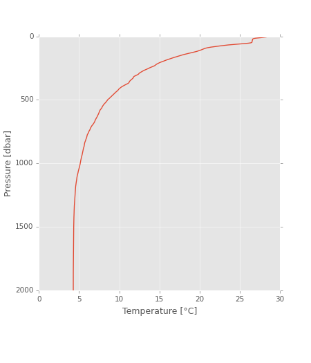

<!-- pandoc --from markdown_github README.md --to rst --output README.txt -->

python-ctd
==========

Tools to load hydrographic data into pandas DataFrame (and some rudimentary methods for data pre-processing/analysis).

This module can load [SeaBird CTD (CNV)][SBE], [Sippican XBT (EDF)][XBT],
and [Falmouth CTD (ASCII)][FSI] formats.

[SBE]: http://www.seabird.com/software/SBEDataProcforWindows.htm

[XBT]: http://www.sippican.com/

[FSI]: http://www.falmouth.com/

Quick intro
-----------
~~~~~~~~~~~~~~~~~~~~~~~~~~~~~~~~~~~~~~~~~~~~~~~~~~~~~~~~~~~~~~~~~~~~~~~ {.bash}
 pip install ctd
~~~~~~~~~~~~~~~~~~~~~~~~~~~~~~~~~~~~~~~~~~~~~~~~~~~~~~~~~~~~~~~~~~~~~~~~~~~~~~~

~~~~~~~~~~~~~~~~~~~~~~~~~~~~~~~~~~~~~~~~~~~~~~~~~~~~~~~~ {.python .numberLines}
from ctd import DataFrame
cast = DataFrame.from_cnv('./test/data/CTD/g01l06s01.cnv.gz', compression='gzip')
downcast, upcast = cast.split()
fig, ax = downcast['t090C'].plot()
~~~~~~~~~~~~~~~~~~~~~~~~~~~~~~~~~~~~~~~~~~~~~~~~~~~~~~~~~~~~~~~~~~~~~~~~~~~~~~~

We can do [better](http://www.go-ship.org/Manual/McTaggart_et_al_CTD.pdf):

~~~~~~~~~~~~~~~~~~~~~~~~~~~~~~~~~~~~~~~~~~~~~~~~~~~~~~~~ {.python .numberLines}
from ctd import DataFrame, lp_filter, movingaverage
cast = DataFrame.from_cnv('./test/data/CTD/g01l06s01.cnv.gz', compression='gzip', below_water=True)
downcast, upcast = cast.split()
temperature = downcast['t090C'].despike(n1=2, n2=20, block=100)
temperature.index = lp_filter(temperature.index.values, sample_rate=24.0, time_constant=0.15)
temperature = temperature.bindata(delta=1)
temperature = temperature.interpolate()
temperature = temperature.smooth(window_len=21, window='hanning')
fig, ax = temperature.plot()
ax.axis([0, 30, 2000, 0])
ax.set_ylabel("Pressure [dbar]")
ax.set_xlabel(u'Temperature [\u00b0C]')
~~~~~~~~~~~~~~~~~~~~~~~~~~~~~~~~~~~~~~~~~~~~~~~~~~~~~~~~~~~~~~~~~~~~~~~~~~~~~~~

Not so quick intro
------------------
[Check out the IPython Notebook.](http://nbviewer.ipython.org/urls/raw.github.com/ocefpaf/python4oceanographers/master/content/downloads/notebooks/ctd_proc_example.ipynb)

Author
------
Filipe Fernandes
